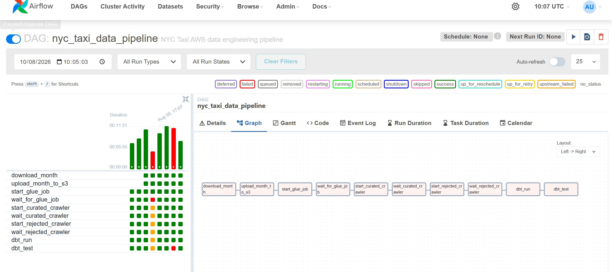
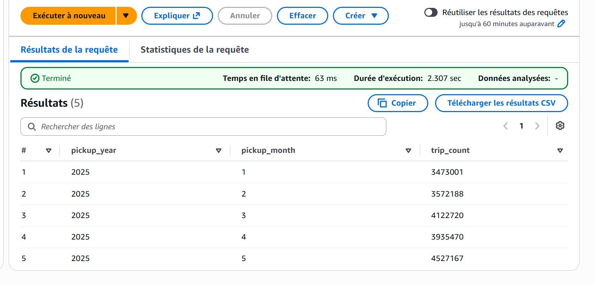
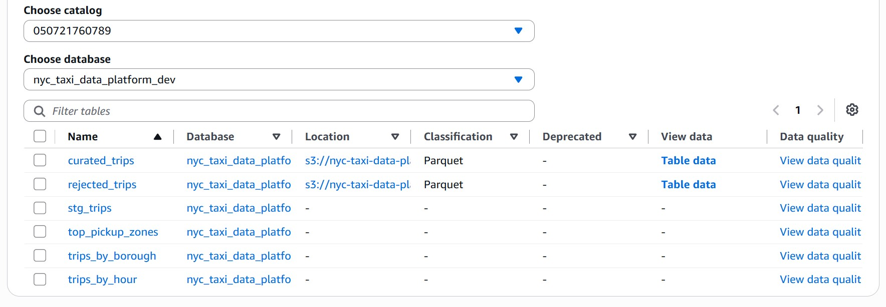
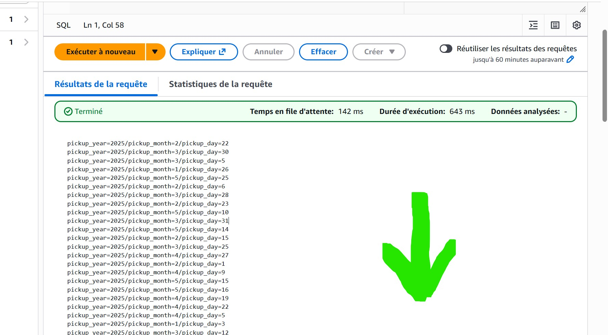
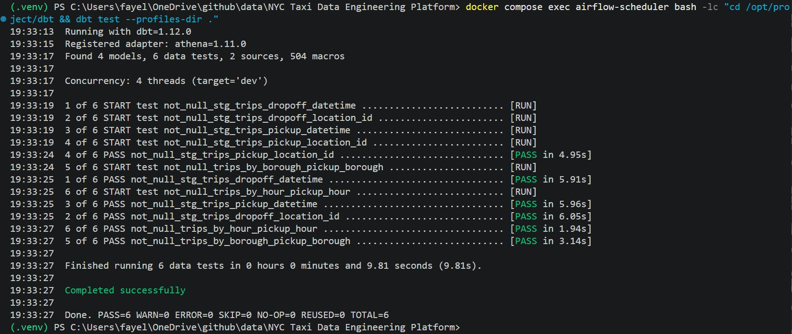
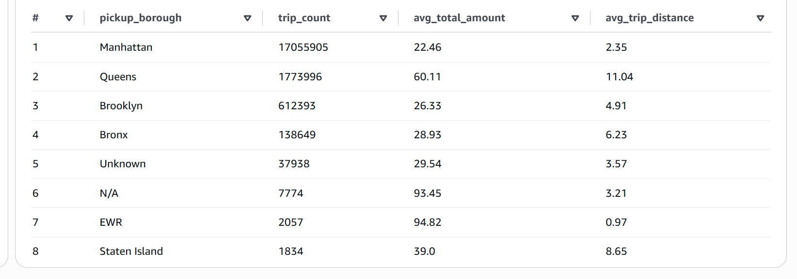

# NYC Taxi Data Engineering Platform

Projet personnel de Data Engineering basé sur les données publiques **NYC TLC Yellow Taxi**.

L'objectif est de construire un pipeline de données complet permettant de télécharger, stocker, transformer, contrôler, cataloguer et analyser plusieurs millions de trajets de taxi.

Le projet utilise principalement **Python, Apache Airflow, AWS S3, AWS Glue, PySpark, AWS Glue Data Catalog, Athena, dbt, Docker et Terraform**.

---

## Objectif du projet

Le pipeline permet de :

- télécharger automatiquement les fichiers NYC Taxi ;
- choisir une période avec une `start_date` et une `end_date` ;
- télécharger automatiquement tous les mois nécessaires ;
- stocker les données brutes dans Amazon S3 ;
- transformer les données avec AWS Glue et PySpark ;
- appliquer des règles de qualité ;
- séparer les données valides et les anomalies ;
- conserver l'historique des données déjà traitées ;
- partitionner les données par année, mois et jour ;
- mettre à jour automatiquement le Glue Data Catalog ;
- interroger les données avec Amazon Athena ;
- créer des modèles analytiques avec dbt ;
- tester les modèles dbt ;
- orchestrer l'ensemble du pipeline avec Apache Airflow ;
- gérer l'infrastructure AWS avec Terraform.

---

## Architecture

```textNYC TLC
   |
   v
Monthly Parquet Files
   |
   v
Apache Airflow
   |
   v
Download required months
   |
   v
Amazon S3 RAW
   |
   v
AWS Glue / PySpark
   |
   +-------------------+
   |                   |
   v                   v
S3 CURATED         S3 REJECTED
   |                   |
   +---------+---------+
             |
             v
        Glue Crawlers
             |
             v
      Glue Data Catalog
             |
             v
        Amazon Athena
             |
             v
             dbt
             |
   +---------+----------+
   |         |          |
   v         v          v
Borough    Hours    Pickup Zones
```

---
## Technologies utilisées

| Technologie | Utilisation |
|---|---|
| Python | ingestion et automatisation |
| Apache Airflow | orchestration du pipeline |
| Docker | environnement Airflow local |
| Amazon S3 | stockage du Data Lake |
| AWS Glue | transformation ETL |
| PySpark | traitement distribué |
| Glue Crawlers | découverte des données |
| Glue Data Catalog | catalogue des tables et partitions |
| Amazon Athena | requêtes SQL sur S3 |
| dbt | transformations analytiques et tests |
| Terraform | Infrastructure as Code |
| SQL | validation et analyses |
| Git / GitHub | versioning du projet |

---

# Pipeline

## 1. Paramétrage de la période

Le DAG Airflow accepte deux paramètres :

```text
start_date
end_date
```

Format :

```text
JJ/MM/AAAA
```

Exemple :

```text
start_date = 25/03/2025
end_date   = 10/05/2025
```

Airflow détermine automatiquement les mois nécessaires.

Dans cet exemple, il télécharge :

```text
Mars 2025
Avril 2025
Mai 2025
```

Même si le fichier de mars est téléchargé entièrement, seules les données à partir du **25 mars** sont traitées.

De la même façon, seules les données jusqu'au **10 mai inclus** sont prises en compte.

---

## 2. Ingestion

Le script :

```text
src/extraction/download_trips.py
```

télécharge les fichiers Parquet depuis NYC TLC.

Les données sont ensuite envoyées vers S3 avec cette organisation :

```text
raw/
└── trips/
    └── year=2025/
        ├── month=01/
        ├── month=02/
        ├── month=03/
        ├── month=04/
        └── month=05/
```

Exemple :

```text
raw/trips/year=2025/month=03/yellow_tripdata_2025-03.parquet
```

La zone `raw` conserve les données sources.

Les anciens mois ne sont pas supprimés lorsqu'un nouveau traitement est exécuté.

---

# Orchestration Airflow

Le DAG principal est :

```text
airflow/dags/nyc_taxi_pipeline.py
```

Le pipeline contient actuellement **10 tâches** :

```text
download_month
      |
      v
upload_month_to_s3
      |
      v
start_glue_job
      |
      v
wait_for_glue_job
      |
      v
start_curated_crawler
      |
      v
wait_curated_crawler
      |
      v
start_rejected_crawler
      |
      v
wait_rejected_crawler
      |
      v
dbt_run
      |
      v
dbt_test
```

Airflow pilote donc tout le pipeline de l'ingestion jusqu'aux tests analytiques.

---

## XCom

Airflow utilise également **XCom** pour transmettre le `JobRunId` AWS Glue entre les tâches.

La tâche :

```text
start_glue_job
```

lance le job Glue et récupère son identifiant.

Elle l'enregistre avec :

```python
xcom_push()
```

La tâche :

```text
wait_for_glue_job
```

le récupère ensuite avec :

```python
xcom_pull()
```

Cela permet de surveiller précisément le job Glue qui vient d'être lancé.

---

# Transformation AWS Glue

Le script principal est :

```text
glue_jobs/transform_trips_job.py
```

AWS Glue utilise **PySpark** pour transformer plusieurs millions de lignes.

Le job reçoit notamment :

```text
--START_DATE
--END_DATE
--SOURCE_TRIPS_PATH
--SOURCE_ZONES_PATH
--CURATED_OUTPUT_PATH
--REJECTED_OUTPUT_PATH
```

Les dates sont transmises dynamiquement par Airflow.

---

## Filtrage de la période

Les fichiers téléchargés contiennent parfois des lignes en dehors de la période demandée.

Le job Glue filtre donc les données à partir de :

```text
START_DATE <= pickup_datetime <= END_DATE
```

Les données situées hors de l'intervalle demandé ne sont pas considérées comme des anomalies.

Elles sont simplement ignorées pour ce run.

---

# Qualité des données

Après le filtrage de la période, les données sont séparées en deux catégories.

```text
processing_data
       |
   +---+---+
   |       |
   v       v
curated  rejected
```

### Curated

Contient les trajets considérés comme valides.

```text
s3://.../curated/trips/
```

### Rejected

Contient uniquement les lignes qui ne respectent pas les règles de qualité du pipeline.

```text
s3://.../rejected/trips/
```

Cela évite de mélanger :

- données valides ;
- anomalies réelles ;
- données simplement situées hors de la période demandée.

---

# Partitionnement

Les données transformées sont partitionnées par :

```text
pickup_year
pickup_month
pickup_day
```

Exemple :

```text
curated/trips/
└── pickup_year=2025/
    └── pickup_month=3/
        ├── pickup_day=25/
        ├── pickup_day=26/
        ├── pickup_day=27/
        ├── pickup_day=28/
        ├── pickup_day=29/
        ├── pickup_day=30/
        └── pickup_day=31/
```

Ce partitionnement permet :

- de limiter les données lues ;
- d'améliorer les performances Athena ;
- de retraiter uniquement certaines périodes ;
- de conserver l'historique déjà présent.

---

## Overwrite dynamique

Spark est configuré avec :

```python
spark.sql.sources.partitionOverwriteMode = dynamic
```

Le pipeline peut donc utiliser :

```python
.mode("overwrite")
```

sans supprimer toutes les anciennes données.

Seules les partitions présentes dans le nouveau traitement sont remplacées.

Par exemple, si le pipeline retraite :

```text
25/03/2025 -> 31/03/2025
```

les données de janvier, février, avril ou mai restent présentes.

---

# Glue Data Catalog

Deux crawlers AWS Glue sont utilisés :

```text
nyc-taxi-data-platform-dev-curated-trips-crawler

nyc-taxi-data-platform-dev-rejected-trips-crawler
```

Ils mettent automatiquement à jour le Data Catalog après les transformations.

Les principales tables sont :

```text
curated_trips
rejected_trips
```

Le catalogue détecte également les partitions :

```text
pickup_year
pickup_month
pickup_day
```

---

# Amazon Athena

Athena permet d'interroger directement les fichiers Parquet présents sur S3.

Exemple de validation :

```sql
SELECT
    pickup_year,
    pickup_month,
    COUNT(*) AS trip_count
FROM nyc_taxi_data_platform_dev.curated_trips
GROUP BY
    pickup_year,
    pickup_month
ORDER BY
    pickup_year,
    pickup_month;
```

Cette requête permet notamment de vérifier que les différents mois restent présents après plusieurs exécutions du pipeline.

---

# dbt

dbt est utilisé après la création des tables Athena.

Les principaux modèles analytiques sont :

```text
stg_trips
trips_by_borough
trips_by_hour
top_pickup_zones
```

### stg_trips

Prépare les données avant les analyses.

### trips_by_borough

Agrège les trajets par borough.

### trips_by_hour

Analyse le nombre de trajets selon l'heure de prise en charge.

### top_pickup_zones

Identifie les zones de départ les plus utilisées.

---

## Tests dbt

Le pipeline exécute automatiquement :

```bash
dbt test
```

Les tests actuels vérifient notamment :

```text
pickup_datetime
dropoff_datetime
pickup_location_id
dropoff_location_id
pickup_borough
pickup_hour
```

Validation finale :

```text
PASS=6
WARN=0
ERROR=0
TOTAL=6
```

---

# SQL

Le dossier :

```text
sql/
```

contient les requêtes utilisées pour analyser et valider le pipeline.

Structure :

```text
sql/
├── analytical_queries/
│   └── analytics_queries.sql
│
└── validation_queries/
    ├── monthly_trip_counts.sql
    ├── curated_date_range.sql
    └── rejected_count.sql
```

### analytical_queries

Contient les requêtes d'analyse :

- nombre total de trajets ;
- trajets par borough ;
- trajets par heure ;
- montant moyen ;
- distance moyenne ;
- autres analyses métier.

### validation_queries

Contient les requêtes permettant de contrôler le fonctionnement du pipeline.

Par exemple :

```text
monthly_trip_counts.sql
```

vérifie que les différents mois sont toujours présents.

```text
curated_date_range.sql
```

vérifie les dates minimum et maximum présentes.

```text
rejected_count.sql
```

compte le nombre d'anomalies envoyées vers `rejected`.

---

# Infrastructure as Code

L'infrastructure AWS est gérée avec **Terraform**.

Le dossier :

```text
terraform/
```

contient notamment la configuration de :

```text
Amazon S3
IAM
AWS Glue Job
Glue Crawlers
Glue Data Catalog
Athena Workgroup
```

Commandes principales :

```bash
terraform init
terraform validate
terraform plan
terraform apply
```

Terraform permet de versionner et reproduire l'infrastructure du projet.

---

# Structure du projet

```text
NYC-Taxi-Data-Engineering-Platform/
│
├── airflow/
│   └── dags/
│       └── nyc_taxi_pipeline.py
│
├── data/
│
├── dbt/
│   ├── models/
│   ├── tests/
│   ├── dbt_project.yml
│   └── profiles.yml.example
│
├── glue_jobs/
│   └── transform_trips_job.py
│
│
├── reports/
│   ├── screenshots/
│   └── athena_validation.md
│
├── sql/
│   ├── analytical_queries/
│   └── validation_queries/
│
├── src/
│   ├── extraction/
│   ├── quality/
│   └── transformation/
│
├── terraform/
│
├── .env.example
├── .gitignore
├── docker-compose.yml
├── Dockerfile.airflow
├── LICENSE
├── Makefile
├── PROJECT_CONTEXT.md
├── README.md
└── requirements.txt
```

---

# Validation du pipeline

Le pipeline a été testé de bout en bout avec plusieurs millions de trajets NYC Taxi.

Les étapes suivantes sont opérationnelles :

```text
Téléchargement automatique         ✅
Upload S3                          ✅
Traitement multi-mois              ✅
Filtrage start_date / end_date     ✅
AWS Glue / PySpark                 ✅
Curated / Rejected                 ✅
Partitionnement année/mois/jour    ✅
Conservation de l'historique       ✅
Glue Crawlers                      ✅
Glue Data Catalog                  ✅
Amazon Athena                      ✅
dbt run                            ✅
dbt test                           ✅
Terraform                          ✅
Apache Airflow                     ✅
```

Un run complet Airflow contient **10 tâches**.

Les tests dbt terminent avec :

```text
PASS=6
ERROR=0
```

---

# Screenshots

## Pipeline Airflow



## Nombre de trajets par mois dans Athena



## Tables du Glue Data Catalog



## Partitions Curated



## Tests dbt



## Analyses Athena



---

# Exécution locale

Airflow fonctionne avec Docker.

Démarrage :

```bash
docker compose up -d
```

Vérification :

```bash
docker compose ps
```

Interface Airflow :

```text
http://localhost:8080
```

Le DAG peut ensuite être déclenché avec une période comme :

```text
start_date = 01/03/2025
end_date   = 31/03/2025
```

---

# Sécurité

Les fichiers contenant des informations locales ou sensibles ne sont pas versionnés.

Par exemple :

```text
.env
dbt/profiles.yml
terraform.tfstate
terraform.tfstate.backup
.terraform/
dbt/target/
airflow/logs/
```

Des fichiers d'exemple sont fournis lorsque nécessaire :

```text
.env.example
dbt/profiles.yml.example
```

---

# Résultat

Le projet permet aujourd'hui de partir de fichiers NYC TLC bruts et d'obtenir automatiquement des données :

```text
ingérées
→ stockées
→ nettoyées
→ contrôlées
→ partitionnées
→ cataloguées
→ interrogées
→ modélisées
→ testées
```

L'ensemble du workflow est orchestré par **Apache Airflow** et l'infrastructure AWS est gérée avec **Terraform**.

Le projet met en pratique un pipeline Data Engineering complet, depuis l'ingestion jusqu'à la mise à disposition des données pour l'analyse.