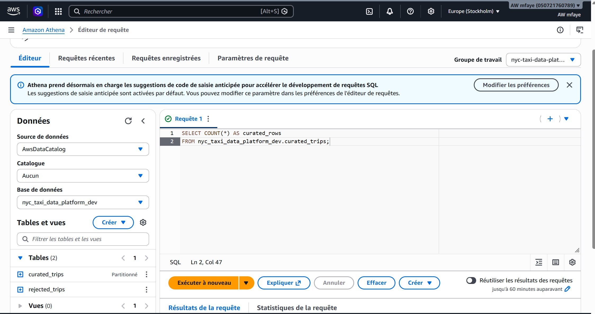
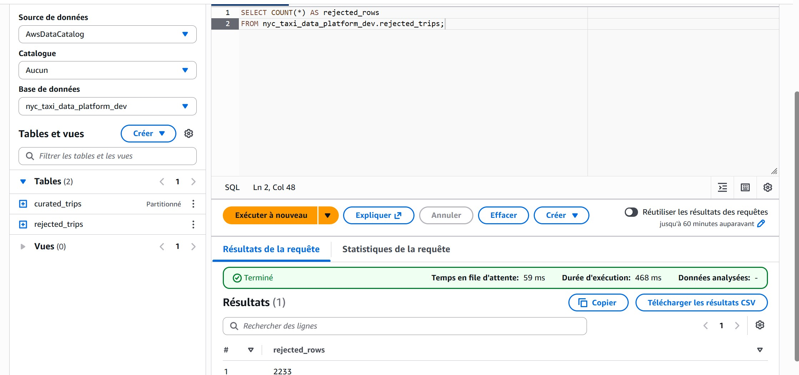

# Validation des données avec Amazon Athena

## Objectif

Cette étape permet de vérifier que la transformation réalisée par AWS Glue n'a entraîné aucune perte de données.

Le fichier source Yellow Taxi de janvier 2025 contient :

**3 475 226 lignes**

Le job AWS Glue sépare les données en deux ensembles :

- `curated_trips` : trajets considérés comme valides ;
- `rejected_trips` : trajets identifiés comme anormaux selon les règles de qualité définies dans le pipeline.

Les deux tables sont enregistrées dans AWS Glue Data Catalog et interrogées avec Amazon Athena.

---

## Architecture de validation

```text
NYC Taxi raw data
       |
       v
     AWS S3
       |
       v
AWS Glue / PySpark
       |
       +-------------------+
       |                   |
       v                   v
curated/trips/       rejected/trips/
       |                   |
       +---------+---------+
                 |
                 v
        AWS Glue Data Catalog
                 |
                 v
             Athena SQL
```

Base Glue utilisée :

```text
nyc_taxi_data_platform_dev
```

Tables :

```text
curated_trips
rejected_trips
```

---

## 1. Nombre de lignes dans les données curated

Requête Athena :

```sql
SELECT COUNT(*) AS curated_rows
FROM nyc_taxi_data_platform_dev.curated_trips;
```

Résultat :

```text
3 472 993 lignes
```

### Capture Athena



---

## 2. Nombre de lignes rejetées

Requête Athena :

```sql
SELECT COUNT(*) AS rejected_rows
FROM nyc_taxi_data_platform_dev.rejected_trips;
```

Résultat :

```text
2 233 lignes
```

### Capture Athena



---

## 3. Réconciliation des données

Le contrôle final consiste à vérifier que toutes les lignes du fichier brut sont présentes soit dans les données curated, soit dans les données rejetées.

```text
Curated     : 3 472 993
Rejected    :     2 233
             -----------
Total       : 3 475 226
```

Nombre de lignes du fichier source :

```text
3 475 226
```

Donc :

```text
curated + rejected = raw
```

✅ **Aucune ligne n'a été perdue pendant la transformation AWS Glue.**

---

## 4. Résultat du contrôle

| Contrôle | Résultat |
|---|---:|
| Lignes source | 3 475 226 |
| Lignes curated | 3 472 993 |
| Lignes rejected | 2 233 |
| Lignes après transformation | 3 475 226 |
| Perte de données | 0 |
| Réconciliation | ✅ Réussie |

La transformation conserve donc **100 % des lignes du dataset source**, tout en isolant les trajets considérés comme anormaux.

---

## Technologies utilisées

- Amazon S3
- AWS Glue
- Apache Spark / PySpark
- AWS Glue Data Catalog
- AWS Glue Crawlers
- Amazon Athena
- SQL
- Terraform

---

## Conclusion

Cette validation démontre que le pipeline :

1. ingère les données brutes dans Amazon S3 ;
2. transforme les données avec AWS Glue et PySpark ;
3. sépare les données exploitables des anomalies ;
4. catalogue les datasets avec AWS Glue Data Catalog ;
5. permet leur interrogation avec Amazon Athena ;
6. vérifie par SQL que le nombre total de lignes est conservé.

La couche `curated` peut maintenant être utilisée pour les étapes analytiques suivantes du projet.